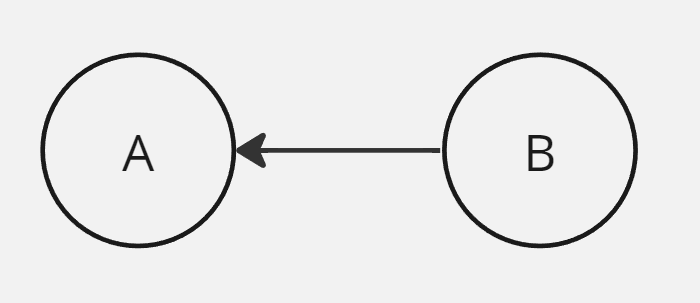
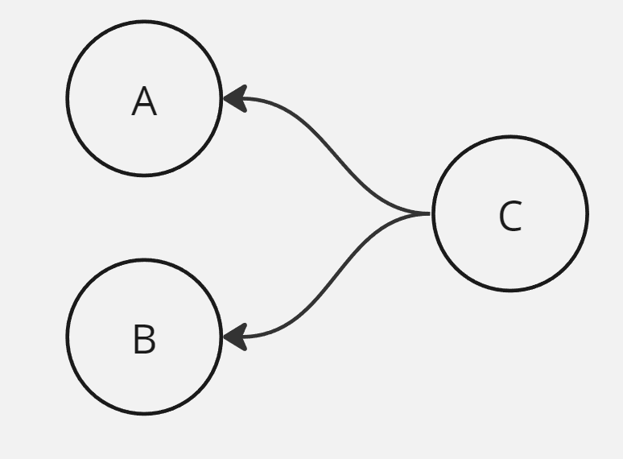
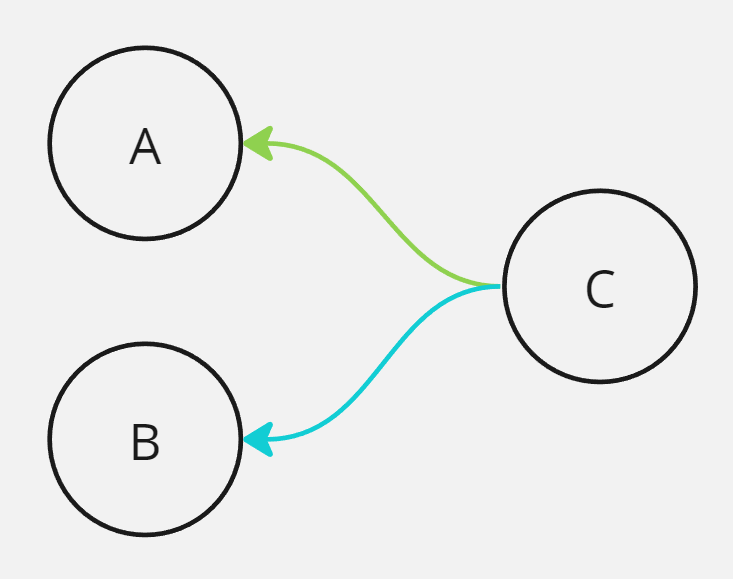
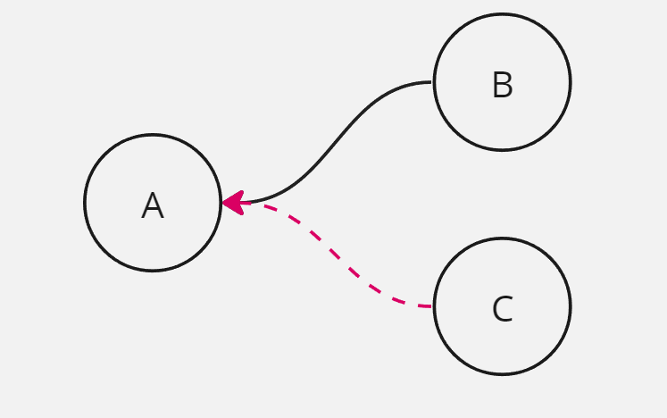
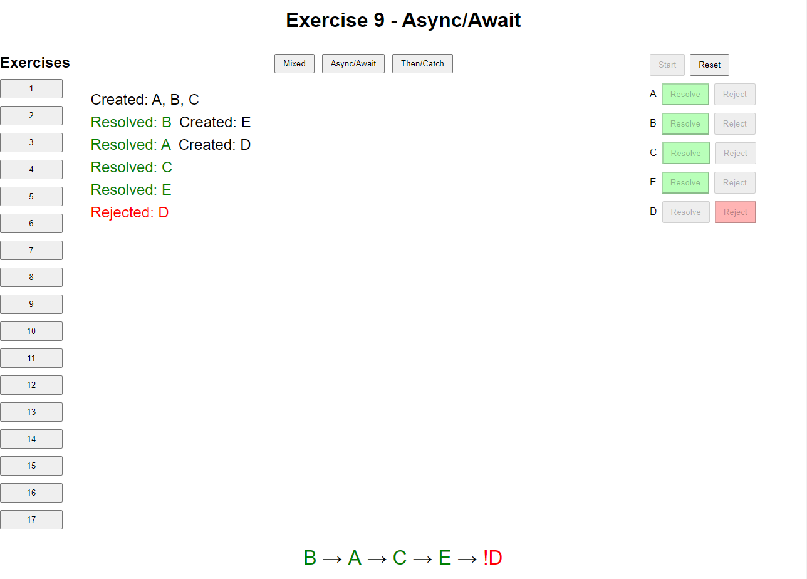
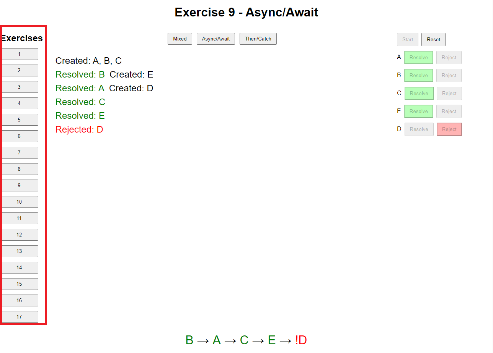
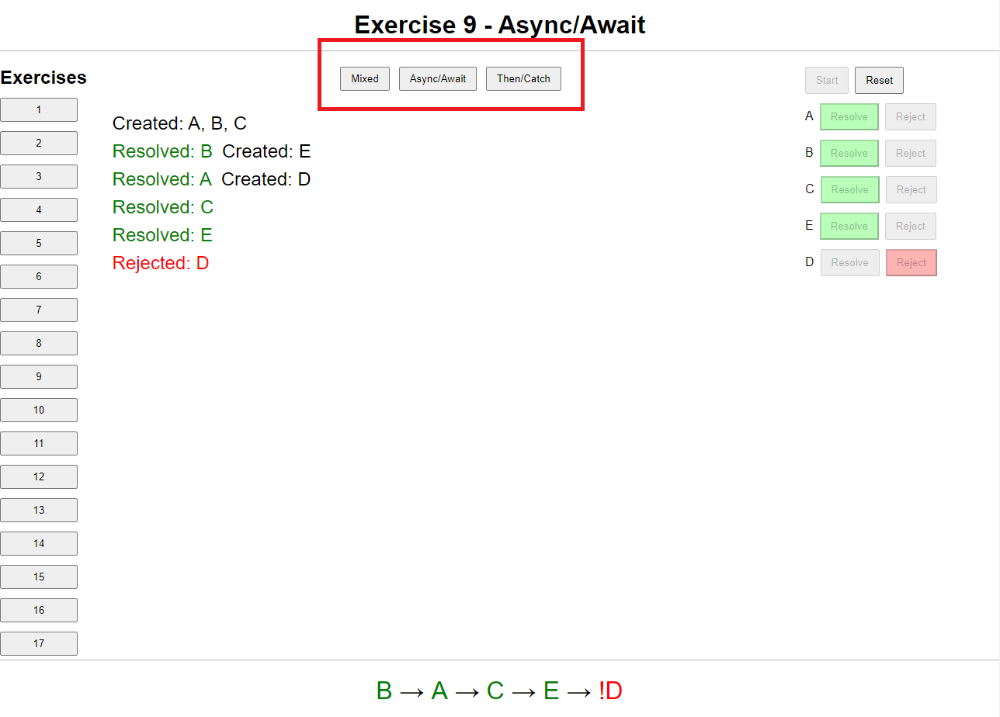
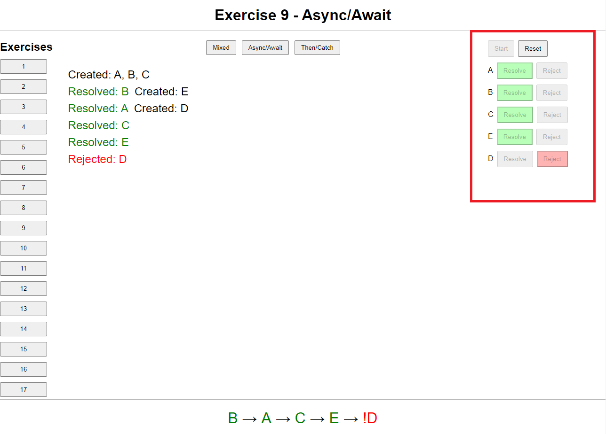
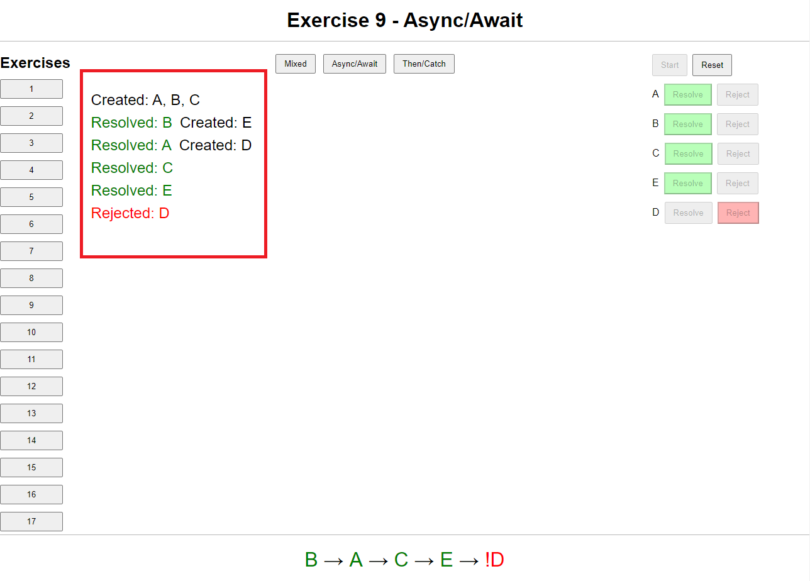
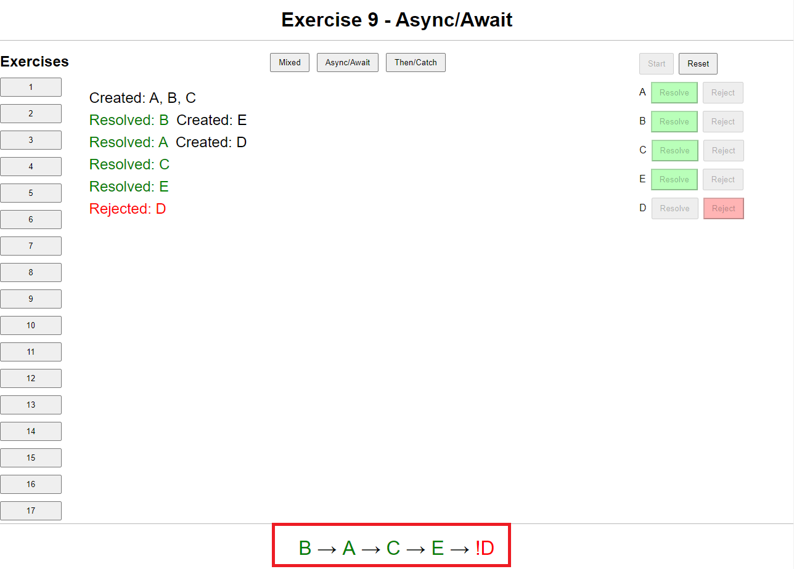

# Promises Training

> [!WARNING]  
> DO NOT INSTALL THIS PACKAGE AS A DEPENDENCY! (See: [Getting Started](#getting-started))

Currently, promises are the de-facto way of handling asynchronous tasks in Javascript, and because of that, they're a fundamental part of any Javascript developer's knowledge.

However, when we're learning promises for the first time, we only learn **enough to get by**, that is, we learn a little bit of how to use promises, (nowadays, most likely with `async/await` only), the `Promise.all` method and that's it.

While this approach makes sense for beginners because it is enough to solve most problems in their daily lives, a recurring issue is that they **stop there**, that is, they never go past this initial knowledge.

And it's precisely this "learn just enough to get by" posture that holds many developers at their current level, as solving more complex problems requires a deeper understanding.

So, if you want to take your developer skills to the **next level**, swimming in shallow waters **won't cut it**, you **must go deeper**, you need to fully understand promises, and how they work, you need to be proficient in both `async/await` and `then/catch` styles of promise handling, and be able to orchestrate asynchronous tasks in the most efficient way possible.

Also, as promises are ultimately an abstraction to handle asynchronous tasks, being able to tackle common problems related to asynchronous programming is a must.

With that in mind, we created this project precisely to help you do this deep dive into promises and asynchronous programming.

By providing both explanations and practical exercises surrounding these topics, this project aims to be your companion in this journey to master them.

Even if you're already a seasoned developer, you might learn a thing or two, like, for example, you might want to try solving `concrete/parallelMaxConcurrency`, `concrete/concurrencyOverride`, `concrete/extractingResolvers` and `/foundation/promise` as they present some interesting challenges.

> [!IMPORTANT]
> This project is not intended for people who are learning promises for the first time, as it assumes that you have at least some basic knowledge of promises, what they represent and how to use them both with `async/await` and `then/catch`.

## Table of Contents

- [Getting Started](#getting-started)
- [Levels](#levels)
- [Tests](#tests)
- [Exercises](#exercises)
  - [Graph Exercises](#graph-exercises)
    - [UI](#ui)
    - [Tests](#tests-1)
  - [Concrete Exercises](#concrete-exercises)
  - [Foundation Exercises](#foundation-exercises)
- [Solutions](#solutions)
- [Upgrading](#upgrading)
- [License](#license)

## Getting Started

> [!WARNING]  
> ATTENTION: THIS REPO IS NOT MEANT TO BE CLONED UNLESS YOU'RE CONTRIBUTING
> IF YOU'RE AN END USER, PLEASE FOLLOW THE INSTRUCTIONS BELOW

First, to install the project, run:

```sh
npm create promises-training@latest
```

> [!NOTE]
> This project is exercise-driven, so the main goal is to solve them.

Occasionally, there will be explanations along with the exercises to help you understand what needs to be done, and also some context about the problem being solved.

Exercises are divided into three categories:

- Graph -> Exercises that involve orchestrating tasks according to dependency graphs.
- Concrete -> Exercises that simulate real-world problems.
- Foundation -> Exercises based on the foundations of promises and their implementation, and common helpers.

> [!IMPORTANT]
> There isn't an specific order for categories, you can start from any of them and switch to another one even before finishing the other one completely. Howerer, the exercises have different [levels](#levels) that will be discussed next.

Exercises are located within `src/exercises/<category>` folders, where `<category>` is one of the categories mentioned above.

For **graph** exercises, the base explanations are located in this README, in the [graph section](#graph-exercises), and for each exercise, there is a `graph.png` that depicts the dependency graph for that specific exercise.

For **concrete** and **foundation** exercises, the explanations are located in the `README.md` inside the exercise's folder (e.g. `src/exercises/concrete/parallelChunks/README.md`).

To solve an exercise, you need to edit the `src/exercises/<category>/<exercise>/exercise.ts` file.

After solving an exercise, you may check your solution by running:

```sh
npm run check <category>/<exercise>.test.ts
```

Tests are located within `src/tests`.

Generally, you will only work inside the exercises folder as tests are devised in a way that they tell you exactly what went wrong without having to look at their implementation, but if for any reason you get stuck or curious, you may peek at them.

The `src/lib` folder is intended for internal use only, so don't bother with it.

Also, to keep your installation forwards compatible with future versions, **DO NOT** modify any file outside the `src/exercises` folder.

## Levels

Besides categories, exercises are also divided into levels, where exercises increase in difficulty as you progress through the levels.

There are three levels:

1. Beginner
2. Intermediate
3. Advanced

Keep in mind that this classification is somewhat subjective, so YMMV and also you don't necessarily need to complete all exercises in a level to move to the next one.

### Beginner

- Graph -> 1 to 8
- Concrete
  - serial
  - parallelChain
  - retry
  - serialCollectErrors
  - parallelCollectErrors
  - parallelChunks

### Intermediate

- Graph -> 9 to 17
- Concrete
  - retryWithTimeout
  - retryWithBackoff
  - parallelCollectRetry
  - parallelMaxConcurrency
  - concurrencyAbort
  - concurrencyEnqueue
  - concurrencyOverride
  - extractingResolvers
- Foundation
  - promiseAll
  - promiseAllSettled
  - promiseAny
  - promiseRace
  - promiseReject
  - promiseResolve
  - readFile
  - wait

### Advanced

- Graph -> 18 and beyond
- Foundation
  - promise

> [!NOTE]
> As you can see, currently, there aren't that many advanced exercises, but the idea is that new exercises will be added over time.

## Tests

Each exercise is accompanied by automated tests so that you can check your solution.

To run a single exercise's tests, run:

```sh
npm run check <category>/<exercise>
```

For example, to run the tests for the `parallelChunks` exercise, run:

```sh
npm run check concrete/parallelChunks
```

Or, to run the graph exercise number 2, run:

```sh
npm run check graph/2/test.test.ts
```

> [!NOTE]
> In the previous example, we needed to append `/test.test.ts` to the exercise's file otherwise it would also run for other graph exercises starting with `2`, for example: exercises from 2 to 29.

We use [Vitest](https://vitest.dev/guide/) as the test runner, so all of its CLI options are available.

Also, it's important to mention that graph exercises have some peculiarities, in the sense that they are **generated automatically from the graph itself**, and because of that, some exercises have a HUGE number of tests (some exercises have over 100k tests).

Of course, we don't run all of them as it would be prohibitively slow, so we only run a subset of them and it's possible to **tweak the number of tests that are run** and the also the **subset**.

You may read more in the [graph exercises section](#graph-exercises).

## Exercises

Currently, there are three exercise categories:

1. Graph
2. Concrete
3. Foundation

### Graph Exercises

A big part of dealing with asynchronous tasks is orchestrating them so that each task starts as soon as possible, and to properly orchestrate these tasks we need to understand the dependency relations between them.

In this category, you'll be presented with a dependency graph in each exercise and then you'll orchestrate the tasks in the graph in the most efficient way possible.

As the exercise is focused on the orchestration itself, tasks are created by calling `createPromise(label)`, where `label` is a string that identifies the task.

Take this graph, for example:



There are two tasks in this graph, `A` and `B`, and `B` depends on `A`, which is represented by the arrow that comes out from `B` and points to `A`.

This means that `B` can only start after `A` has finished and `A`, as it doesn't depend on any other task, can start right away.

Thus, the most efficient implementation for this graph would be:

```js
await createPromise("A");
await createPromise("B");
```

Tasks can also depend on more than one task:



In this graph, `C` depends on both `A` and `B`, so it can only start after both `A` and `B` have finished.

However, both `A` and `B` don't depend on any other task, so they can start right away.

The most efficient implementation for this graph would be:

```js
await Promise.all([createPromise("A"), createPromise("B")]);
await createPromise("C");
```

Tasks can also have multiple different sets of dependencies where, if any of the sets is satisfied, then the task can start:



In this graph, `C` depends **either** on `A` **or** on `B`, which is represented by using different colors for each dependency set. The colors themselves don't have any specific meaning, they are used like this just so the dependencies are distinguished from one another.

Therefore, `C` can start as soon as either `A` or `B` has finished.

```js
await Promise.any([createPromise("A"), createPromise("B")]);
await createPromise("C");
```

Last but not least, promises have two possible outcomes: they can either be fulfilled or rejected.



In this graph, we have task `B` which depends on `A`'s fulfillment and task `C` which depends on `A`'s rejection.

> [!IMPORTANT]  
> Dashed edges are used to represent promise rejections.

This means that `B` can only start after `A` has been fulfilled and `C` can only start after `A` has been rejected.

As only one of these outcomes is possible, either `B` or `C` will not be carried out.

Corresponding implementation:

```js
try {
  await createPromise("A");

  try {
    await createPromise("B");
  } catch {}
} catch {
  await createPromise("C");
}
```

When doing graph exercises, you'll notice that three functions are being exported: `mixed`, `asyncAwait`, `thenCatch`.

The idea is for you to provide 3 different implementations:

- `mixed`: this one is completely free, you can mix both async/await and then/catch,
- `asyncAwait`: in this one you should only use async/await
- `thenCatch`: in this one you should only use then/catch.

This way you'll be proficient in both styles of promise handling.

Also, at the end of the file, you'll notice that exports are being wrapped in a `skipExercise`, which skips tests for that specific implementation so that it doesn't litter the output.

As you implement a solution for each of those three, remove the `skipExercise` call for the implementation you want the tests to run. For example: if you already implemented the `mixed` solution, remove the `skipExercise` from it but keep the ones for `asyncAwait` and `thenCatch` until you implement them.

#### UI

To aid you in debugging your implementation for the graph exercises, we created a UI that allows you to simulate different execution "paths".

To open the UI, run:

```sh
npm run graph:ui
```

The UI is served as a web app and it looks like this.



Now let's explore each section:



The sidebar on the left allows you to select the exercise you want to debug.



This top section allows you to select the implementation you want to debug.



The right sidebar lets you control the exercise's execution flow by resolving/rejecting promises.

As promises are created, new entries are added to the sidebar.



This section at the center shows the records of the promises that were created and resolved/rejected at each step.



This section at the bottom shows a summary of the promises that were resolved/rejected at each step, in order.

#### Tests

As graph exercises are based on graphs (duh), it's possible to generate **all possible tests** for a given exercise automatically, which is what we do.

As one might imagine, the number of generated tests is sometimes HUGE, so we have a **cap** on the maximum number of tests that are run.

Also, to prevent biases, we don't run tests in the order they were generated, instead, we **shuffle** them.

This shuffling happens right after the tests are first generated, so that tests are **deterministic**, that is, every time you run graph exercises tests, you'll be running the same **subset** of tests.

However, it's possible to **tweak** both the **cap** and the **subset** of tests that are run.

To tweak the cap, you can run `npm run graph:setGraphTestsCap <number>`.

For example, to set the cap to 10000, run:

```sh
npm run graph:setGraphTestsCap 10000
```

To tweak the subset of tests that are run, you can run `npm run graph:shuffleGraphTestData <graph-exercise-number>`, which will reshuffle the tests for the specified graph exercise, which will then result in a different subset of tests.

For example, to reshuffle the tests for graph exercise number 2, run:

```sh
npm run graph:shuffleGraphTestData 2
```

### Concrete Exercises

Graph exercises are great for understanding the dependency relations between tasks, however, they don't cover the full spectrum of possible scenarios, as only tasks whose dependencies are known at compile time and fixed can be represented by a graph.

Therefore we have this category of concrete exercises, where you'll be presented with concrete scenarios that you'll have to implement.

As each exercise in this category is unique, their description is colocated with their folder.

### Foundation Exercises

Foundation exercises are designed to help you reinforce your understanding of the foundations of promises, by reimplementing promise-related functions and, eventually, the promise itself.

Descriptions are colocated with exercises.

## Solutions

Solutions to the exercises can be found in this repo, e.g. https://github.com/henriqueinonhe/promises-training/blob/master/src/exercises/concrete/concurrencyAbort/exercise.ts .

However, we recommend that you only check the solutions after you've solved the exercise yourself, as the goal is for you to learn by solving the exercises.

Also, keep in mind that currently the solutions presented are **not necessarily the best ones**, which means that even if your solutions don't resemble the ones you'll find here at all, it doesn't mean that they're bad.

## Upgrading

To ease upgrading to newer versions we created a migration script that automatically migrates your installation to the latest version while preserving your solutions.

To run the migration script, run:

```sh
npm create promises-training@latest -- --migrate
```

## License

This project is licensed under [CC-BY-NC-ND 4.0](https://creativecommons.org/licenses/by-nc-nd/4.0/legalcode).

The goal behind this project is to be a FREE learning resource and for it to remain free and accessible forever.

Here is a Q&A of some common questions regarding the license:

> Can I use this project for self or group study?

Yes, please do.

> Can I use this project in an internal company training?

Yes, as long as you credit the project and make it clear that the project is **freely accessible** independently of the training.

> Can I use this project for my paid mentoring/workshop sessions?

Yes, as long as you credit the project, make it clear that the project is **freely accessible** independently of the mentoring/workshop, make it clear that you're charging for your time and not for the project itself, make it clear that the project is not part of your own material and make it clear that we do not endorse you or your services.

> Can I use this project for my paid online course?

Yes, as long as you credit the project, make it clear that the project is **freely accessible** independently of the online course, make it clear that you're charging for your time and not for the project itself, make it clear that the project is not part of your own material and make it clear that we do not endorse you or your services.

> Can I create a fork of this project and use it for my own purposes?

No, you can't. You can only use this project as is, without any modifications. This is necessary to prevent people from creating forks and then charging for them.

> Can I create an online course based on this project?

No, you can't, because we don't want people creating "wrappers" around this project and then charging for them.

If you have any questions regarding the license, or want to talk about a specific use case, feel free to reach me at henriqueinonhe@gmail.com.
